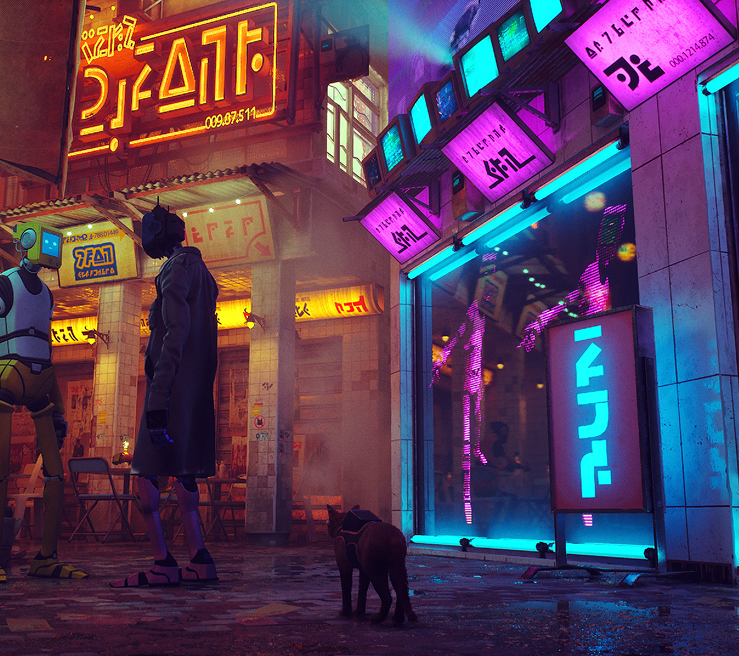

# Nurmuhammad Ali

**Junior Frontend Developer**  
Uzbekistan | +998 90 123 45 67 | nurmuhammad.ali@example.com  
Discord: Nurmuhammad-Ali#1234

[GitHub Profile](https://github.com/Nurmuhammad-Ali)  
[GitHub Pages (CV)](https://nurmuhammad-ali.github.io/rsschool-cv/)

---

## ![My Photo]

---

## About Me

Beginner frontend developer. Motivated to learn and grow in IT. Responsible, focused, and fast learner. Interested in clean code, best practices, and real projects.

---

## Skills

- HTML, CSS, JavaScript
- Git, GitHub
- VS Code, Figma
- Markdown, BEM

---

## Code Example

**Task from Codewars:** [My Codewars Profile](https://www.codewars.com/users/Nurmuhammad-Ali)

```js
// Codewars Kata: Return Negative
function makeNegative(num) {
  return num > 0 ? -num : num;
}
```

## Contacts

- Telegram: @nurali
- Email: ali@example.com

## Hobbies
- BJJ
- Coding
- Reading
